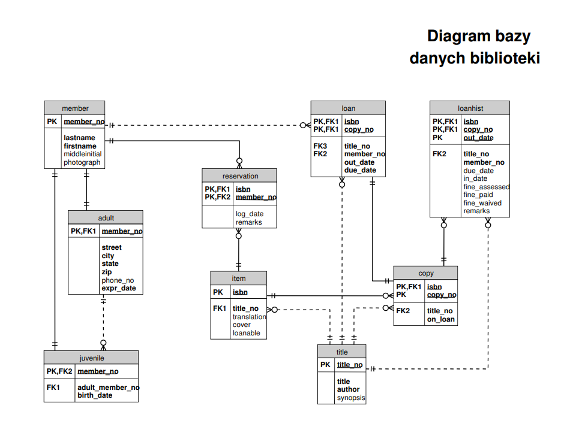
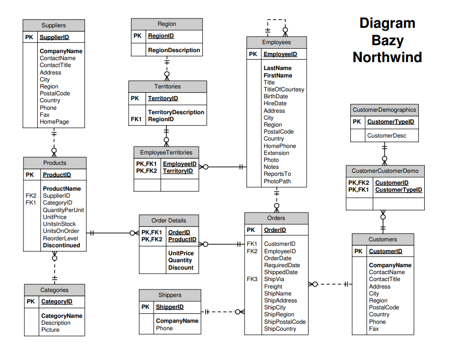

# Databases

This repository contains SQL query exercises performed on the **Northwind** and **Library** databases. The focus is on practicing various SQL operations, including data retrieval, joins, and advanced queries. AGH term 4.

